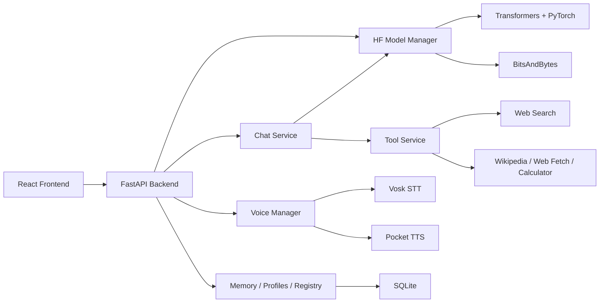

# UltraChat

UltraChat is a local-first AI workspace for running Hugging Face LLMs with built-in model search, automatic quantization workflows, inference acceleration, persistent memory, agent tools, and real-time voice conversation.

It is not just a chat UI. It is a full local model operating layer:

- search and download models from Hugging Face
- materialize multiple local variants like `original`, `4bit`, `8bit`, and `fp16`
- load the best variant for your hardware
- accelerate generation with KV caching, attention optimizations, and speculative decoding
- speak with the model through offline STT and streaming TTS
- keep conversations, memories, profiles, and tool traces in one place

> Download once. Quantize once. Reuse forever. Talk to it naturally.

## Why This Project Is Different

Most local AI apps stop at "pick a model and chat."

UltraChat goes further:

- **Controlled local model pipeline**  
  Models are stored in deterministic local folders under `data/models`, not left scattered in opaque cache paths.

- **Multi-variant model workflow**  
  One download can fan out into multiple reusable variants: `original`, `4bit`, `8bit`, and `fp16`.

- **Quantization built into the product**  
  Quantization is not an external step. It is part of the download and load workflow.

- **Speed features that matter in practice**  
  Flash Attention 2 auto-detection, SDPA fallback, GPU-first loading with CPU-offload fallback, session KV cache reuse, speculative decoding, and optional `torch.compile`.

- **Voice is a first-class mode**  
  This repo ships a real voice pipeline with WebSockets, streaming TTS, offline STT, frontend VAD, voice presets, and custom voice assets.

- **Stateful assistant behavior**  
  Profiles, memories, tool calling, branchable conversations, and stored tool traces are built into the backend and UI.

## What UltraChat Does

| Area | What is implemented |
| --- | --- |
| Model discovery | Search Hugging Face, inspect popular models, fetch model metadata |
| Model storage | Download to local cache, create deterministic local model folders |
| Quantization | Generate `4bit`, `8bit`, and `fp16` variants from original weights |
| Inference | Streaming generation, stopping mid-run, session KV cache reuse |
| Acceleration | Flash Attention 2, SDPA, speculative decoding with assistant model, optional `torch.compile` |
| Chat UX | Markdown rendering, math rendering, edit-and-regenerate, branch navigation |
| Tools | Web search, Wikipedia, webpage fetch, calculator, memory store/search |
| Memory | Profile-scoped persistent memory injected into prompt context |
| Profiles | Reusable personas with prompts and generation defaults |
| Voice | Vosk STT, Pocket TTS, voice uploads, system voices, real-time voice chat |
| Persistence | SQLite for conversations, messages, memories, profiles, voices, and model registry |

## The Core Idea

UltraChat is built around a simple but powerful assumption:

**local AI should manage the full lifecycle of a model, not just inference.**

That means the codebase handles:

1. discovering a model
2. downloading it locally
3. quantizing it into multiple useful forms
4. loading the right form for the current machine
5. accelerating generation
6. exposing everything through a UI that works for text and voice

## What Makes The Model Pipeline Special

The strongest part of this codebase is the model manager in [`backend/core/hf_model_manager.py`](backend/core/hf_model_manager.py).

It does all of the following:

- downloads a Hugging Face model into a controlled local cache
- creates one or more persistent output variants from the same source download
- supports `4bit` and `8bit` BitsAndBytes quantization
- supports `fp16` conversion
- keeps the original full-precision copy when requested
- can fall back to **on-the-fly quantized loading** from original weights if a saved variant does not already exist
- writes marker files so the loader knows whether a local folder is already quantized
- cleans up incomplete downloads safely

This is why the project feels different from a normal frontend-over-Transformers app.

It is closer to a local model workstation.

## Speed Stack

UltraChat is explicitly built to make local models feel faster, not just "work."

### 1. Attention optimization

- Auto-detects **Flash Attention 2** when it is actually usable
- Falls back to **SDPA** when Flash Attention is unavailable or fails at runtime
- Exposes the attention implementation choice in settings

### 2. Quantized loading

- `4bit` and `8bit` loading through BitsAndBytes
- GPU-first loading strategy
- CPU offload fallback when VRAM is not enough

### 3. Session KV cache reuse

- Conversation prompts can reuse cached keys/values across turns
- This reduces repeated prompt prefill work
- Cache is invalidated on branching, editing, or deletion where necessary

### 4. Speculative decoding

- Load a second, smaller assistant model
- The smaller model proposes tokens
- The main model verifies them
- This can materially improve throughput when the model pairing is good

### 5. Optional `torch.compile`

- Available for compatible full-precision / FP16 paths
- Disabled by default because compatibility can vary by environment

## Voice-First Capabilities

UltraChat is unusually strong on voice for a local LLM app.

### Voice stack

- **STT:** Vosk
- **TTS:** Pocket TTS
- **VAD:** `@ricky0123/vad-react` in the frontend
- **Transport:** WebSockets

### Voice features

- live microphone capture
- frontend speech detection
- streaming transcription
- streamed LLM token output
- streamed spoken reply generation
- built-in voice mode UI
- downloadable offline STT models
- preset and custom voices
- system voice library stored in `data/system_voices`

### Voice chat flow

```text
User speech
  -> frontend VAD detects speech window
  -> audio sent to backend WebSocket
  -> Vosk transcribes speech
  -> chat service streams LLM tokens
  -> token chunker groups natural speech segments
  -> Pocket TTS generates streaming audio
  -> frontend plays the reply as it arrives
```

That gives the project something many local assistants still do not have:

**a real speech loop, not just a push-to-transcribe button.**

## Stateful Chat, Not Flat Chat

UltraChat stores more than plain message history.

### Conversations are branchable

- edit a user message
- regenerate from that point
- keep alternate branches
- switch between sibling responses

### Messages store more than content

The backend persists:

- final assistant content
- raw generated content
- optional thinking content
- tool call traces
- prompt/completion token counts
- generation duration

### Profiles shape behavior

Profiles can define:

- persona/system prompt
- default generation settings
- model preference
- last mode
- tool settings and voice-related fields in the database schema

### Memory is persistent

Memories are stored in SQLite and can be:

- profile-scoped
- categorized
- ranked by importance
- injected into future prompts
- created manually or through tool calls

## Agent Tools

UltraChat includes a lightweight tool-use loop in the chat service.

Available tools in the codebase include:

- `web_search`
- `wikipedia`
- `web_fetch`
- `calculator`
- `memory_store`
- `memory_search`

That means the assistant can move beyond pure next-token generation and interact with external information plus its own persistent memory layer.

## Architecture



### High-level structure

```text
backend/
  config/        app settings and defaults
  core/          model manager, voice manager, streaming primitives
  models/        SQLite models and schemas
  routes/        FastAPI endpoints + WebSockets
  services/      chat, memory, profile, tool, search, branching logic

frontend/
  src/components/ chat, models, memory, profiles, settings, voice UI
  src/contexts/   app state and toast state
  src/lib/api.js  REST, SSE, and WebSocket client helpers

data/
  models/         local model variants
  voices/         uploaded voices
  stt_models/     downloaded Vosk models
  tts_cache/      Pocket TTS cache
  system_voices/  built-in voice assets
  ultrachat.db    SQLite database
```

## Tech Stack

### Backend

- FastAPI
- PyTorch
- Hugging Face Transformers
- BitsAndBytes
- aiosqlite
- DDGS / DuckDuckGo search
- httpx
- trafilatura
- Vosk
- Pocket TTS

### Frontend

- React
- Vite
- Tailwind CSS
- `react-markdown`
- KaTeX
- `lucide-react`
- `@ricky0123/vad-react`

## Local Setup

### Requirements

- Python 3.10+ recommended
- Node.js 18+ recommended
- NVIDIA GPU optional but strongly recommended for larger models
- PyTorch installed with the CUDA build that matches your machine if you want GPU inference

### 1. Install backend dependencies

```bash
pip install -r requirements.txt
```

If you want GPU acceleration, install PyTorch separately with the right wheel for your CUDA version. The repo comments currently point to a CUDA 12.8 install path:

```bash
pip install torch torchvision --index-url https://download.pytorch.org/whl/cu128
```

### 2. Install Pocket TTS

Pocket TTS is vendored in the repo and should be installed as an editable package:

```bash
pip install -e ./backend/core/pocket_tts
```

### 3. Install frontend dependencies

```bash
cd frontend
npm install
cd ..
```

### 4. Run in development

Backend:

```bash
python run.py
```

Frontend:

```bash
cd frontend
npm run dev
```

Use:

- frontend: `http://localhost:5173`
- backend: `http://127.0.0.1:8000`
- API docs: `http://127.0.0.1:8000/docs`

### 5. Run as a single served app

If you build the frontend first, FastAPI will serve the compiled app from `frontend/dist`.

```bash
cd frontend
npm run build
cd ..
python run.py
```

## First-Time Workflow

1. Open the **Models** screen.
2. Search for a Hugging Face text-generation model.
3. Pick one or more download variants: `original`, `4bit`, `8bit`, `fp16`.
4. Download the model.
5. Load the main model.
6. Optionally load a smaller assistant model for speculative decoding.
7. Open chat and start a conversation.
8. If you want voice mode, load TTS, download/load a Vosk STT model, then start voice chat.

## Best-Fit Model Compatibility

UltraChat is built around `AutoModelForCausalLM` and `AutoTokenizer`.

That means the best fit is:

- local Hugging Face causal LLMs
- Transformer-compatible instruct/chat models
- models that work well with PyTorch + Transformers + BitsAndBytes

This repository is **not** centered on:

- Ollama-managed models
- GGUF / llama.cpp runtimes
- hosted API-only model providers

So the strongest accurate claim is:

**UltraChat can run a very wide range of Hugging Face local LLMs, then quantize and accelerate them inside one integrated workflow.**

## Provider Stress Lab

The chat header's **Provider stress lab** selector can keep the local Hugging
Face workflow or test a ML Junction gateway through four transport modes:

- **ML Junction native**: `http://localhost:8001/v1/responses`
- **OpenAI SDK**: gateway root `http://localhost:8001`, using its
  `/openai/v1/chat/completions` facade
- **Anthropic SDK**: gateway root `http://localhost:8001`, using its
  `/anthropic/v1/messages` facade
- **ML Junction LangChain SDK**: shown only when `langchain_mljunction` is
  installed in the UltraChat Python environment

Each remote mode accepts a custom gateway root and model name; the model picker
can discover `GET /v1/models`, but manual model names are always accepted. API
keys can be remembered in the current browser's local storage so localhost
testing does not require re-entering them. The stress lab includes a
**Forget saved key** action and an opt-out toggle. Keys are never stored in
UltraChat's SQLite conversation database or `data/config.json`; browser local
storage is plaintext to scripts running on the same origin, so use this only on
a trusted local installation.

Remote requests can stream or run non-streaming, expose route/tool events in a
debug timeline, call the existing web, calculator, weather, memory, and file
tools, and run a nested strict-JSON subagent. The full-system file list/read
tools accept Windows and Linux paths. File writes and shell commands are
available only after the browser asks for confirmation for that individual chat
turn; command output and exit status are displayed in the tool/debug timeline.

For a remote-only installation with no PyTorch or local-model dependencies:

```bash
pip install -r requirements-remote.txt
python run.py
```

The Local HF, model-download, quantization, and local voice-generation controls
remain unavailable until the normal local-model dependencies—including PyTorch—
are installed.

## Storage Layout

```text
data/
  config.json
  ultrachat.db
  exports/
  memories/
  models/
  stt_models/
  system_voices/
  tts_cache/
  voices/
```

## Why This Codebase Stands Out

UltraChat is unique because it combines all of these in one product:

- local Hugging Face model search and download
- built-in quantization workflow
- deterministic model storage
- acceleration-aware inference loading
- assistant-model speculative decoding
- branchable persistent chat
- profile-scoped memory
- tool-calling
- real-time voice conversation

That combination is the identity of the project.

It is not only "a local chatbot."

It is a **local AI runtime + interface layer** designed to make serious local model usage practical, fast, and natural.

## Code References

If you want to inspect the most important implementation files first:

- [`backend/core/hf_model_manager.py`](backend/core/hf_model_manager.py)
- [`backend/services/chat_service.py`](backend/services/chat_service.py)
- [`backend/core/voice_manager.py`](backend/core/voice_manager.py)
- [`backend/routes/voice.py`](backend/routes/voice.py)
- [`frontend/src/components/ModelsView.jsx`](frontend/src/components/ModelsView.jsx)
- [`frontend/src/components/ChatView.jsx`](frontend/src/components/ChatView.jsx)
- [`frontend/src/components/VoiceMode.jsx`](frontend/src/components/VoiceMode.jsx)
- [`frontend/src/components/VoiceChatSession.jsx`](frontend/src/components/VoiceChatSession.jsx)

## Status

UltraChat already contains the major building blocks of a serious local AI workstation:

- model pipeline
- acceleration stack
- stateful chat
- persistent memory
- tool-calling
- real-time voice
- frontend management UI

It is already much more than a simple local chat frontend.
